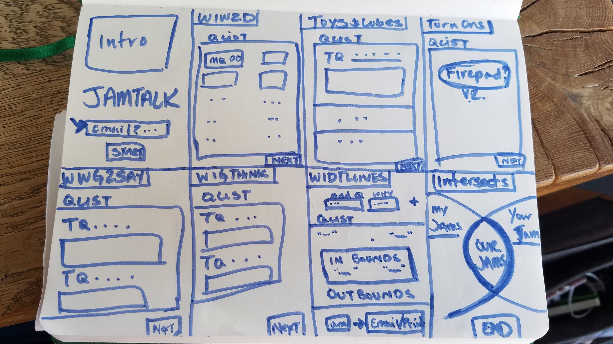
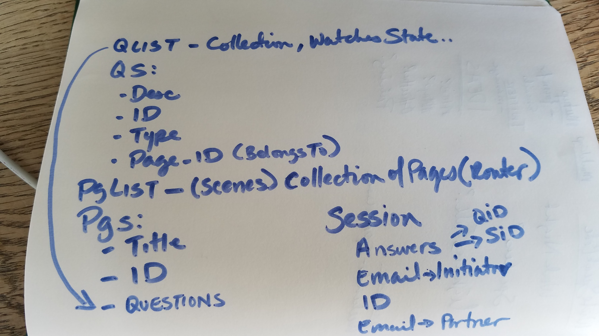

#JamTalk

## Description
JamTalk is an app that will help you and your partner talk about what your jam is (i.e. your likes & desires.)

### Features
- **My Jams** : This feature allows a user to assess their wants, preferences, turn-ons, language, thoughts, and boundaries
- **JamUp** : This feature allows a user to find out where they and another person intersect
- **TeaTime** : This feature allows a user with/without their partner, to find ways to navigate their jams.

### ScreenShots/Wireframes



## Context
### Motivation
This app is inspired by the worksheets from an Autostraddle Article: http://www.autostraddle.com/you-need-help-here-is-a-worksheet-to-help-you-talk-to-partners-about-sex-237385/
I really wanted to be able to have the ease of documenting this info for yourself and then being able to ask someone else to take time to think about it for themselves. then have a way to discuss what comes out of it, in a smart way.

### Personas
Persona 1 - Initiator
persona 2 - Partner/Survey Reciever
persona 3 - Cautious User

### User Flow

####(Izzy Initiator)
 1. I want to take some time to explore my own desires and boundaries, so i open up the JamTalk app and start a session.
 2. I start out on the Action Jams page, thinking through what I like to do/be done. when i finish i click next and go to the next page.
 3. I land on the Jam-quipment page, and talk about all the toys and other equipment that are my jams, then click to the next page.
 4. I land on the Jam-On page. where i make a list of all my turn-ons, even use cute emojis! then move onto the next page.
 5. I land on the Jam-talk'in page, where i write out all the things i like to say and hear, then click to the next page.
 6.

####(Patty Partner/Reciever)
 1. starts here
 2. clicks/moves to here,
 3. completes their goal.
 4.

####(Cassie Cautious)
 1. starts, but wants a way to pause, or skip a page to work on later.
 2. clicks/moves through the site, but has a way to go back to a previous page..
 3. completes the survey, but wants to make sure it doesnt get shared out into the interwebs..
 4.


### User Stories
- As a (type of user/persona), I'd like to (take this action) so that (I fulfill this need).

## Technical Specs


## Requirements Checklist
- [ ] Unit Tests Written (Review Coverage)
- [ ] Style Guide Written
- [ ] Model validations configured
- [ ] Keys/Secrets secure
- [ ] Front-End Accessibility Tested
- [ ] Mobile Responsiveness Tested
- [ ] Deployment configured

## Implementation Instructions
Stay tuned!
<!-- ### Environment Setup
```
add instructions
```
### Running
```
add instructions
```
### Tests
```
add instructions
```
## License
add buttons and info on licensing chosen.
-->
## Contributing
Though this is a personal project at this time, if you'd like to contribute, please contact me, I'd love to pair!

## Resources & Thanks
